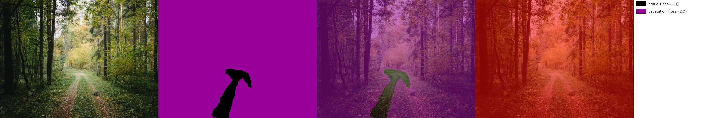
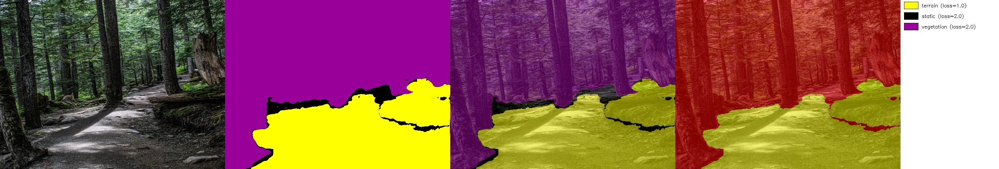
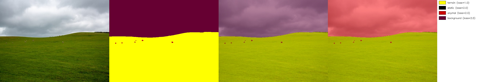
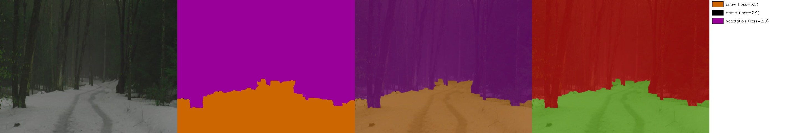
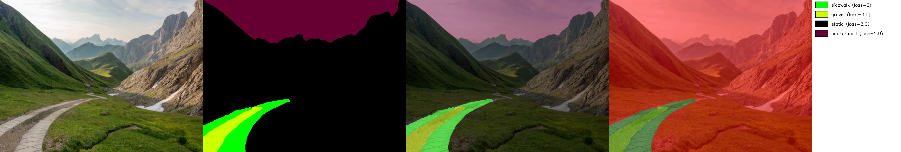
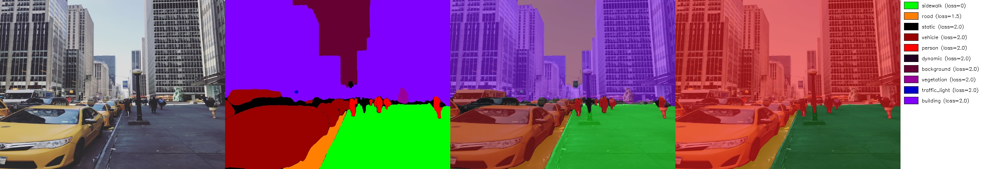

# Preperations

docker build -f docker/Dockerfile.eval --progress=plain -t viplanner-eval .

docker run --rm -it --gpus all -v "$(pwd)":/workspace -e PYTHONPATH=/workspace viplanner-eval bash

# Findings

**Forest**
- Forest Trail: Slightly bad. Depends on if the path is clear or not. 
- Leaf Path: **Bad (1/5)**. Model usually cannot understand paths covered by leaves.

**Other Wild**
- Grass Field: Good (3/3). All detected as "terrain" (loss=1.0)
- Mountain Path: Okay (2/3). Images with clear path (e.g. 01) can be detected into "gravel" or "pathwalk", but unclear ones (e.g. 02, 03) are tended to "terrain (loss=1.0)
- Snowy Path: Okay (2/3). Fully-covered areas are recognised into "terrain" 

**Urban & Indoor**
- Urban Side Walk: **Good (5/5)**. Precisely detect "road" "sidewalk", etc.
- Hallway: **Good (4/4)**. Very precise. 

In general, ViPlanner performs (1) well in urban and indoor scenarios, (2) fairly good in grass, snow or mountain environment, (3) badly in forest, especially for those the path isn't clear.

