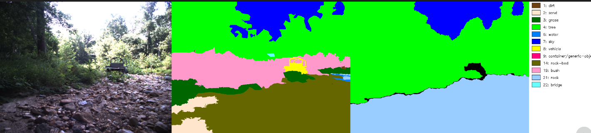
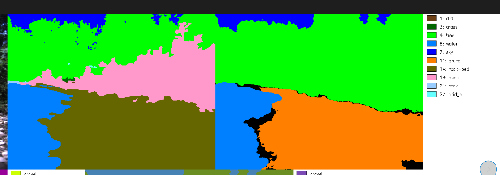
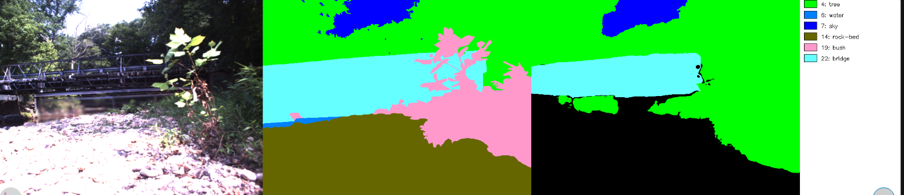
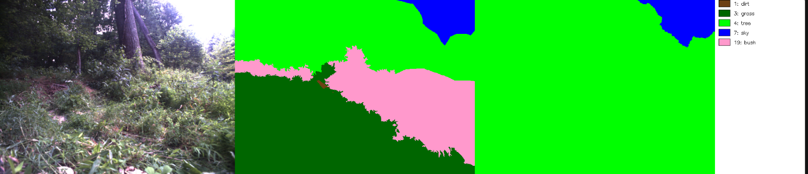
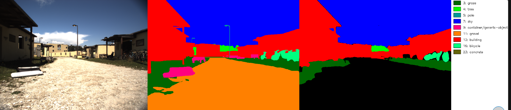
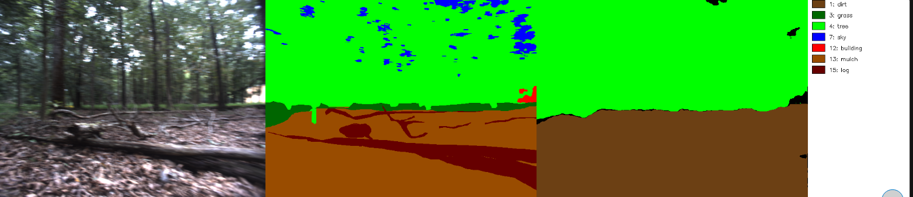

# full check on RUGD dataset


the coco->rugd table remains unchanged (from /home/data/projects/robohike_ros2_ws/src/RPL-RoboHike-ROS2/src/local_planner/viplanner_ros2/experiments/02_RUGD_sanity_check/findings.md)


```bash
docker run -it --rm --net=host --gpus all \
  -v /home/data/projects/robohike_ros2_ws/src/RPL-RoboHike-ROS2/src/local_planner/viplanner_ros2:/workspace \
  -v /home/data/datasets/RUGD:/workspace/data/RUGD_full:ro \
  viplanner-eval /bin/bash

# 进容器后:
cd /workspace && python3 experiments/02-1_RUGD_full_check/run.py
```


---

Some findings
- in coco, "rock-merged" was hardcoded in viplanner into "vegitation" -- doesn't make sense.
  - However this class can be identified into "fairly traversable" in some cases.  
  - I suggest considering making "rock-merged" into `loss=1.5`, as this coco classification both includes (1) small rock paths like gravel (i.e. "rock-bed" in RUGD), and (2) big rocks (i.e. "rock" in RUGD)


### Scene 1 - creek
- bush isn't exist, but belongs to cate "tree" (reasonable to me)
- rock-bed isn't exist, but stably detected as gravel

- Fine-grained definition of "gravel" in m2f: both small-stone path (e.g. pebble path near creek) & tiny-stone path (normally we call it gravel) 

Failure cases:
- too-close bush in front of camera -- robot stay away from bush
  

- over-exposed (extreme light condition)


- mid-height grass being detected as "tree" 


### Scene 2 - Park 

Worth Noting:
1. in COCO, "dirt" is equivalent to "mulch" in RUGD
2. grass detection is mostly stable
3. There isn't "log" & "bush" in COCO, but it can be detected as "tree".


Failure Cases
1. concrete platform is sometimes missing by m2f (coco)


### Scene 3 - Trail

1. m2f tend to take "mulch" & "gravel" as "dirt"

Potential Failure Case:
1. Don't know if "log" can be detected as "obstacle" or "dirt" -- seemingly true 
2. Sometimes, coco cannot detect little gravel/mulch hill.


