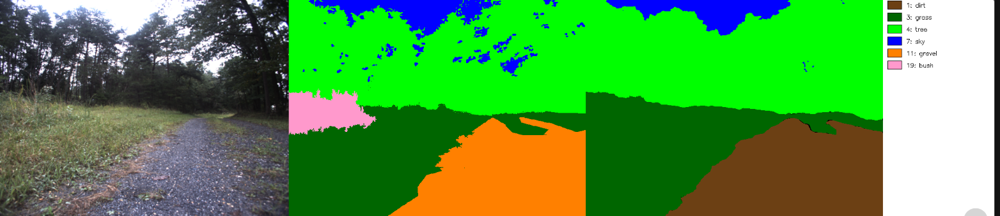
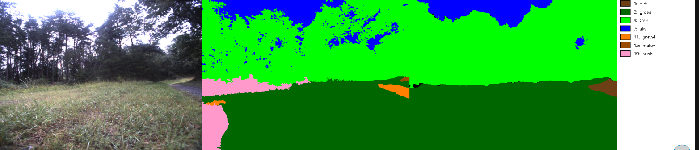
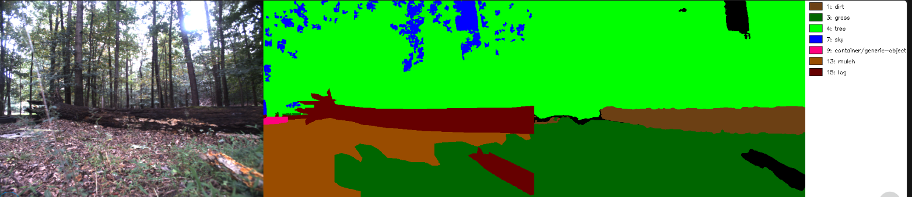
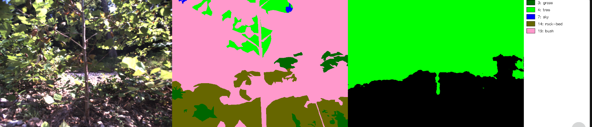

在这个任务中不单只是需要在更大的测试集上测试 m2f 模块的效果

更重要的是, 需要根据测试的结果, 来调整 coco->viplanner 的映射表

因为在用大量野外数据测试的时候, 可能会意识到原有的 coco->viplanner 映射表中有些地形的分类需要调整. 
  - 比如, "dirt-merged" 在原有的映射表里面被认为 "难以行走"(loss=1.5), 但是实际上在真实野外世界的数据集中, m2f 所识别出来的"dirt-merged"区域基本上是可通行的土路.
  - 又比如, 

Interesting Findings: 
1. in COCO, "dirt" is equivalent to "mulch" in RUGD
2. grass detection is mostly stable, and
3. bush isn't exist, but belongs to cate "tree" (reasonable to me) 
4. rock-bed isn't exist, but stably detected as gravel 
5. in coco-viplanner mapping, "rock-merged" was hardcoded into "vegitation" -- doesn't make sense.

Typical Failure Cases:
1. "log" cann't be detected as "obstacle" or "dirt" 
2. over-exposed (extreme light condition) 
3. concrete platform is sometimes missing by m2f (coco) 
4. too-close bush in front of camera -- robot stay away from bush 

**Proposed NEW COCO-Viplanner Mapping Table** 
| ViPlanner 类 | Loss | Ground? | Source COCO category | 备注 |
|---|---|---|---|---|
| `dirt` | **0.0** | ✓ | `dirt-merged` | **土地 (NEW)** |
| `sidewalk` | 0.0 | ✓ | `pavement-merged` | 人行道 |
| `floor` | 0.0 | ✓ | `floor-other-merged`, `floor-wood`, `platform`, `playingfield`, `rug-merged` | 室内地面 |
| `stairs` | 0.0 | ✓ | `stairs` | 楼梯 **UNTESTED**|
| `gravel` | 0.5 | ✓ | `gravel` | 沙砾 (**UNCHANGED**)|
| `grass` | 0.5 | ✓ | `grass-merged` | **草地 (NEW)** |
| `sand` | 0.5 | ✓ | `sand` | 沙地 **UNSEEN**|
| `snow` | 0.5 | ✓ | `snow` | 雪地 **UNSEEN**|
| ~~`terrain`~~ | ~~1.0~~ | ~~✓~~ | ~~`grass-merged`, `dirt-merged`~~ | **DELETED** | 
| `indoor_soft` | 1.0 | ✗ | `towel` | 室内软物 (注: ground=False 但 loss=1.0) |
| `road` | 1.5 | ✓ | `road` | 机动车道 |

**Worth Doing Later (Optional)**
1. Differentiate "grass" into "low-grass" and "mid-grass (lower than bush)"
2. Differentiate "log" from "dirt"  
3. "sand" category doesn't look useful in RUGD dataset. 
4. Fine-grained definition of "gravel" in m2f: both small-stone path (e.g. pebble path near creek) & tiny-stone path (normally we call it gravel) 

| ViPlanner 类 | Loss | Ground? | COCO 来源类 | 备注 |
|---|---|---|---|---|
| `sidewalk` | 0.0 | ✓ | `pavement-merged` | 人行道 |
| `floor` | 0.0 | ✓ | `floor-other-merged`, `floor-wood`, `platform`, `playingfield`, `rug-merged` | 室内地面 |
| `stairs` | 0.0 | ✓ | `stairs` | 楼梯 |
| `gravel` | 0.0 | ✓ | `gravel` | very tiny, sand-like rock path (**NEW**)|
| `stone-path` | 1.0 | ✓ | `gravel` | small stone path like pebbel path near creek (**NEW**)|
| `rock` | 2.0 | ✓ | `rock-merged` | big stones or rocks (**NEW**)|
| `sand` | 0.5 | ✓ | `sand` | 沙地 |
| `snow` | 0.5 | ✓ | `snow` | 雪地 |
| ~~`terrain`~~ | ~~1.0~~ | ~~✓~~ | ~~`grass-merged`, `dirt-merged`~~ | **DELETED** | 
| `vegetation` | ✗ | `potted plant`, `flower`, `tree-merged`, **`mountain-merged`**, ~~**`rock-merged`**~~ |
| `low-grass` | 0.0 | ✓ | `grass-merged` | **low草地 (NEW)** |
| `mid-grass` | 0.5 | ✓ | `grass-merged` | **mid草地 (NEW)** |
| `dirt` | **0.0** | ✓ | `dirt-merged` | **土地 (NEW)** |
| `log` | **2.0** | ✓ | `dirt-merged` | **Obstacle (NEW)** |
| `indoor_soft` | 1.0 | ✗ | `towel` | 室内软物 (注: ground=False 但 loss=1.0) |
| `road` | 1.5 | ✓ | `road` | 机动车道 |

## Remained Problem
1. snow
2. mountain
3. sand

We can keep testing in Grandtour dataset, but for now let's firstly focus on how to use that dataset for thw whole viplanner validation. 